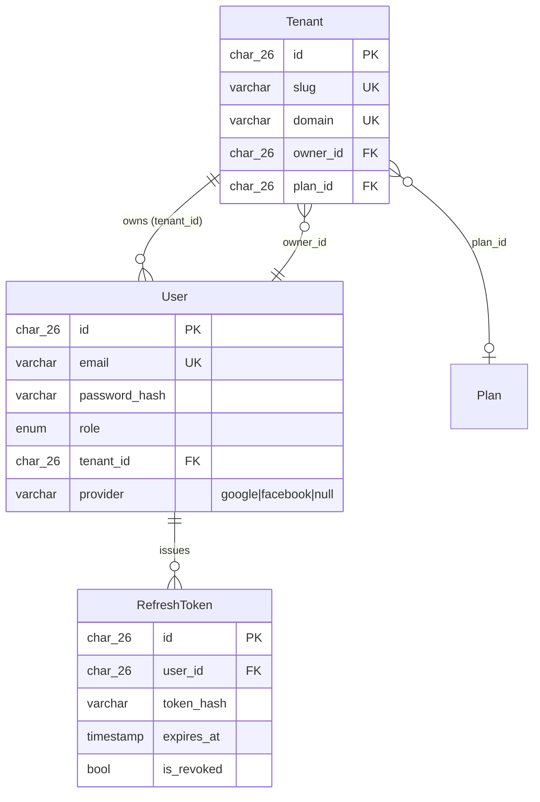
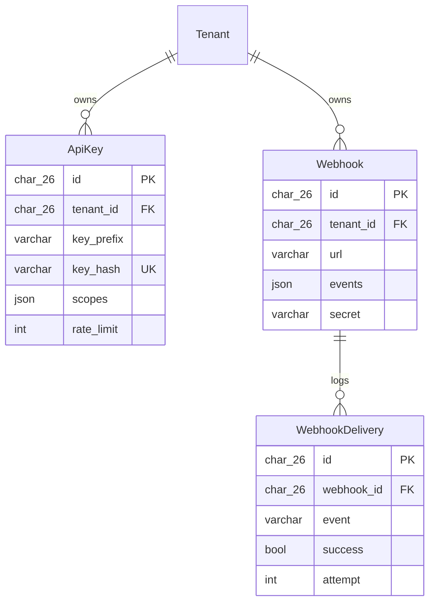
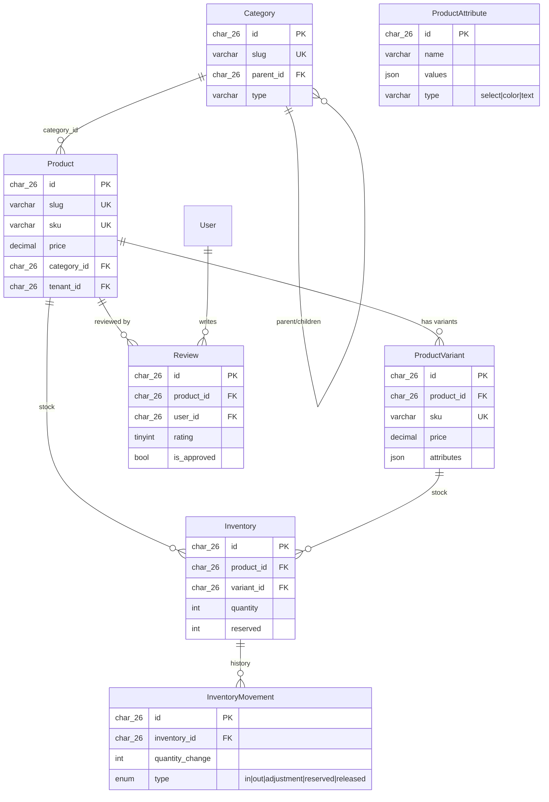
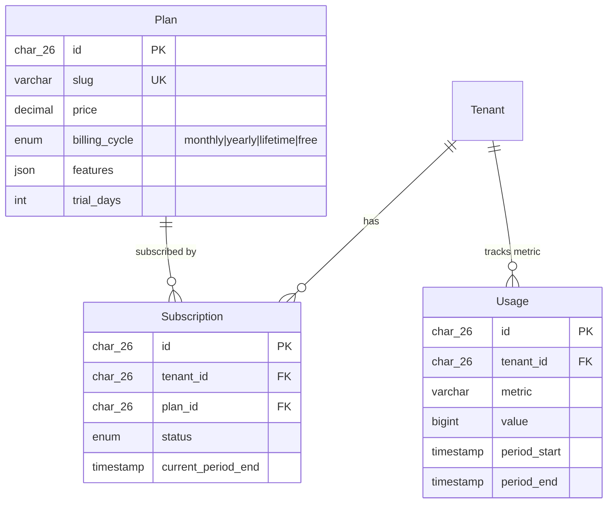
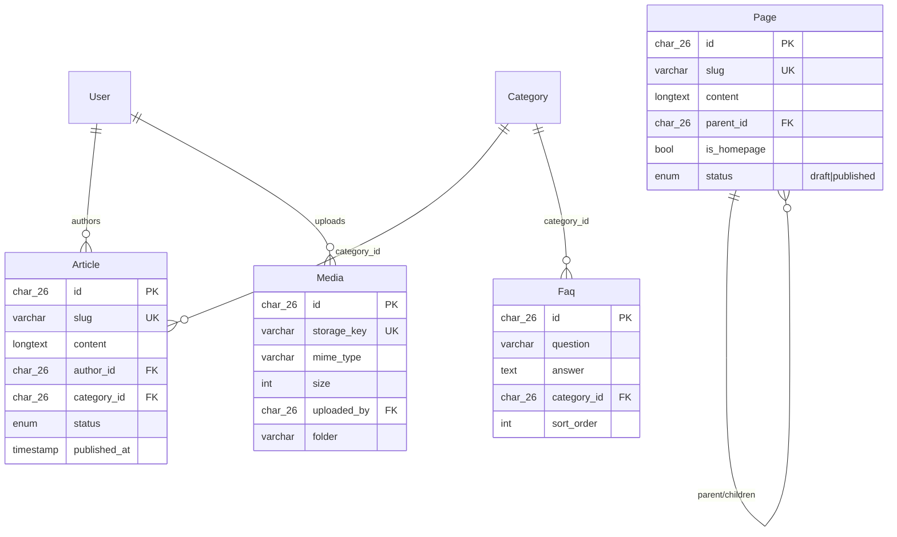
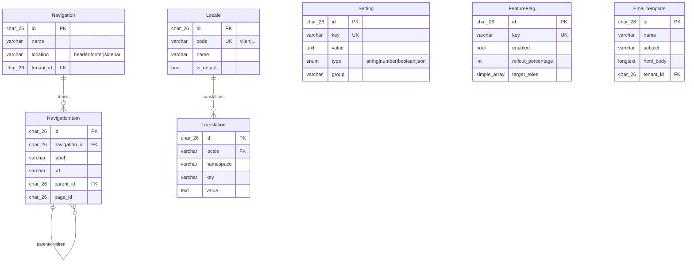
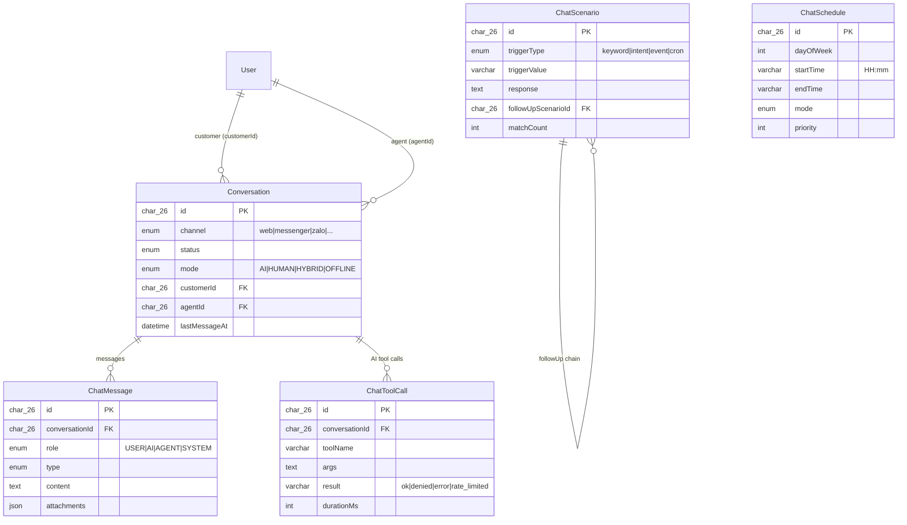
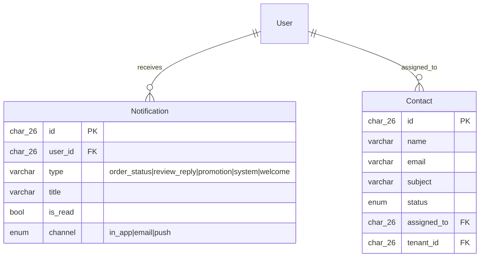
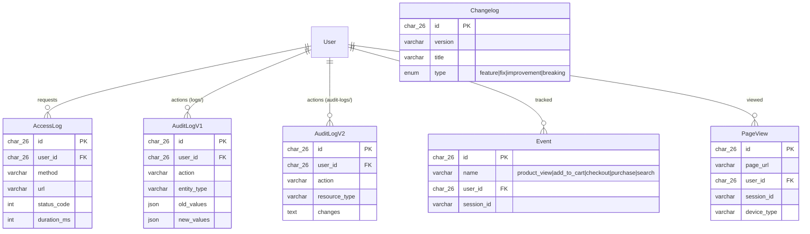

# WebTemplate ERD

> Source of truth: `backend/src/modules/*/entities/*.entity.ts`. ERD la derived view, update cung commit khi sua entity. Ref: CROSS-0007

**Tong**: 47 entities, 24 modules
**Last sync**: 2026-04-18

> Quy uoc: Moi entity extend `BaseEntity` co san `id` (ULID, char(26)), `created_at`, `updated_at`, `deleted_at`. ERD chi liet ke 3-5 column dac trung. Cac FK la ULID rieng le (khong co JoinColumn DB-level constraint tru khi danh dau `FK`).

---

## Module: auth + users + tenants



---

## Module: api-keys + webhooks



---

## Module: products + categories + inventory + reviews (E-commerce core)



---

## Module: cart + orders + payments + promotions

```mermaid
erDiagram
    User ||--o{ Cart : "owns"
    Cart ||--o{ CartItem : "contains"
    Product ||--o{ CartItem : "in cart"
    User ||--o{ Order : "places"
    Order ||--o{ OrderItem : "contains"
    Product ||--o{ OrderItem : "snapshot"
    Order ||--|| Payment : "paid by"
    Promotion ||--o{ PromotionUsage : "used"
    User ||--o{ PromotionUsage : "uses"
    Order ||--o{ PromotionUsage : "applies"

    Cart {
        char_26 id PK
        char_26 user_id FK
        varchar session_id
        enum status "active|merged|converted|abandoned"
    }
    CartItem {
        char_26 id PK
        char_26 cart_id FK
        char_26 product_id FK
        char_26 variant_id
        int quantity
        decimal price
    }
    Order {
        char_26 id PK
        varchar order_number UK
        char_26 user_id FK
        enum status
        decimal total
        json shipping_address
    }
    OrderItem {
        char_26 id PK
        char_26 order_id FK
        char_26 product_id FK
        varchar product_name "snapshot"
        decimal price
        int quantity
    }
    Payment {
        char_26 id PK
        char_26 order_id FK_UK
        varchar method "vnpay|momo|stripe|bank|cod"
        enum status
        decimal amount
    }
    Promotion {
        char_26 id PK
        varchar code UK
        enum type "percentage|fixed|free_shipping|bxgy"
        decimal value
        int usage_limit
        char_26 tenant_id FK
    }
    PromotionUsage {
        char_26 id PK
        char_26 promotion_id FK
        char_26 user_id FK
        char_26 order_id FK
        decimal discount_amount
    }
```

---

## Module: plans + subscriptions



---

## Module: content (articles + pages + faq + categories + media)



---

## Module: navigation + settings + i18n + email-templates + feature-flags



---

## Module: chat (conversations + messages + scenarios + schedules + tool calls)



---

## Module: notifications + contacts



---

## Module: logs + analytics (audit + access + page-views + events + changelog)

> 2 entity `audit_logs` ton tai (legacy `modules/logs` va moi `modules/audit-logs`) — cung table name, KHAC schema. Can resolve trong CROSS-0007 review.


